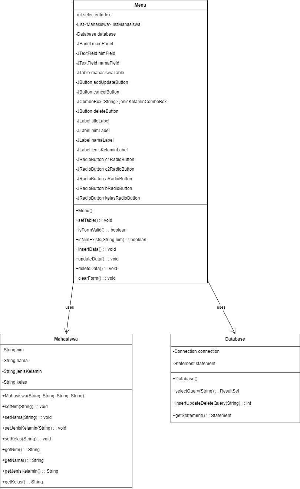

# Tugas Praktikum 4 DPBO 2025 C1
Raffi Adzril Alfaiz - Ilmu Komputer UPI
---

## Janji
Saya, Raffi Adzril Alfaiz dengan NIM 2308355, mengerjakan Tugas Praktikum 5 dalam mata kuliah Desain dan Pemrograman Berorientasi Objek untuk keberkahan-Nya. Maka saya tidak melakukan kecurangan seperti yang telah dispesifikasikan. Aamiin.
---
# Aplikasi Data Mahasiswa - Java Swing

## Deskripsi
Aplikasi ini dibuat menggunakan Java Swing untuk mengelola data mahasiswa berupa **NIM**, **Nama**, **Jenis Kelamin**, dan **Kelas**. Fitur utama mencakup **tambah**, **ubah**, dan **hapus** data yang ditampilkan dalam tabel GUI.

## Desain Program
- **Class `Mahasiswa`**  
  Menyimpan data mahasiswa dengan atribut: `nim`, `nama`, `jenisKelamin`, dan `kelas`.

- **Class `Menu` (extends JFrame)**  
  Komponen utama GUI, mengelola tampilan form input dan tabel, serta menangani logika tambah/edit/hapus.
- **Class `Database`**  
  Mengelola koneksi dan query ke database db_mahasiswa.


## Alur Program
1. **Program dimulai dari `main()`**: Membuat dan menampilkan GUI.
2. **Form input diisi** → Klik **Add** untuk menyimpan data ke list dan tabel.
3. Klik data di tabel → Form terisi otomatis → Tombol berubah jadi **Update/Delete**.
4. **Update** untuk mengubah data terpilih.
5. **Delete** untuk menghapus data dari list dan tabel.
6. **Cancel** untuk reset form.
7. **Terdapat konfigurasi database** untuk menyimpan data mahasiswa.

## Tambahan dari Tugas 4
1. **CRUD Database** : membuat agar program dapat berhubungan dengan database db_mahasiswa, sehingga data tidak akan tereset seperti sebelumnya
2. **Prompt untuk insert NIM yang sudah ada** Program memastikan agar NIM yang sudah ada ketika diinsert ulang memunculkan warning NIM sudah ada dan return program
```java
private boolean isNimExists(String nim) {
   try {
      ResultSet resultSet = database.selectQuery("SELECT nim FROM mahasiswa WHERE nim = '" + nim + "'");
      return resultSet.next();
   } catch (SQLException e) {
      throw new RuntimeException(e);
   }
}
```
3. **Prompt untuk Data yang masih kosong** Program memastikan agar data yang masih kosong ketika diinsert memunculkan warning data masih kosong seperti NIM, Nama, kelas, Jenis kelamin setelehanya akan return program
```java
private boolean isFormValid() {
   List<String> kosong = new ArrayList<>();
   if (nimField.getText().isEmpty()){
   kosong.add("NIM");
   }
   if(namaField.getText().isEmpty()){
   kosong.add("Nama");
   }
   if(jenisKelaminComboBox.getSelectedIndex() == -1){
   kosong.add("Jenis Kelamin");
   }

        boolean kelasSelected = false;
        for (JRadioButton rb : kelasRadioButton) {
            if (rb.isSelected()) {
                kelasSelected = true;
            }
        }
        if (!kelasSelected) {
            kosong.add("Kelas");
        }
        if (!kosong.isEmpty()) {
            javax.swing.JOptionPane.showMessageDialog(null, "Input " + String.join(", ", kosong) + " tidak boleh kosong", "Error", javax.swing.JOptionPane.ERROR_MESSAGE);
            return false;
        }
        return true;
   }
```

## Fungsi Utama
- `insertData()` → Tambah data baru ke list dan refresh tabel.
- `updateData()` → Edit data mahasiswa berdasarkan baris terpilih.
- `deleteData()` → Hapus data dari list dan tabel.
- `clearForm()` → Kosongkan form input.
- `setTable()` → Menyusun dan menampilkan isi tabel berdasarkan list.

## Dokumentasi
[recordDB](Screenshots/Record_Dokumentasi-Database_on_Swing.mp4)


